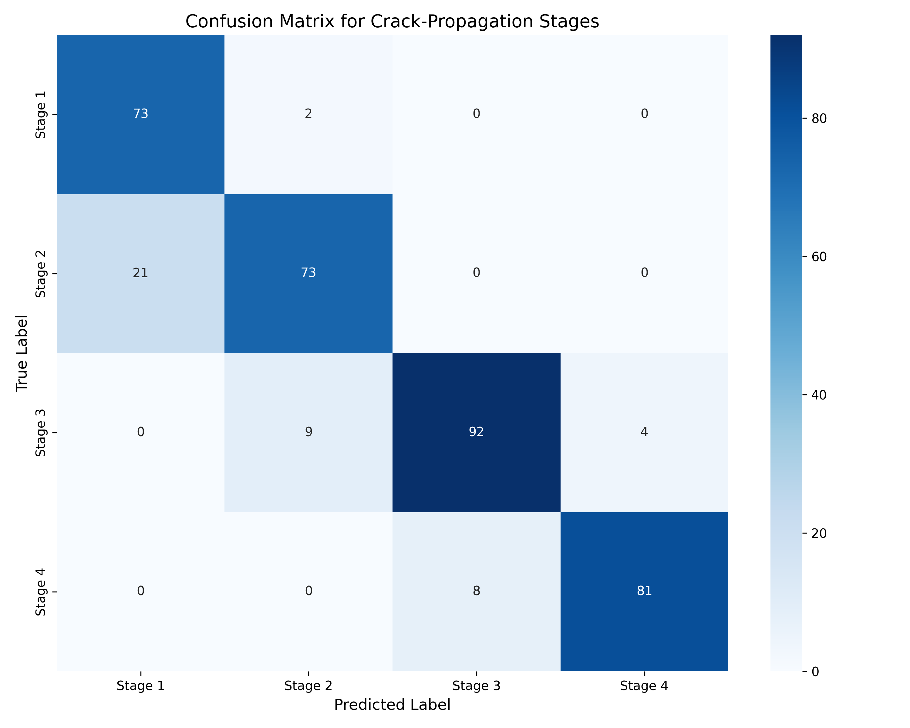
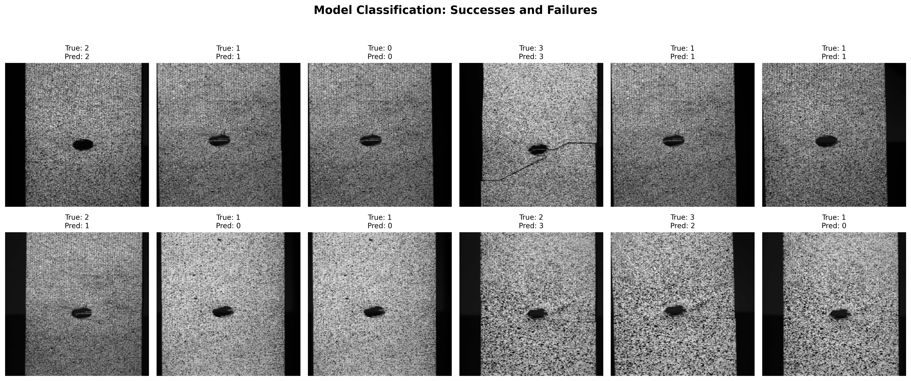

# DL_final_report

This repository contains the implementation of a Deep Learning model for crack propagation stage classification. It includes data preprocessing, CNN architecture, training, evaluation, and visualization scripts. Designed for reproducibility, the code is modular, efficient, and adheres to standard practices in PyTorch.

---

## Table of Contents
- [Overview](#overview)
- [Features](#features)
- [Installation](#installation)
- [Usage](#usage)
- [Dataset](#dataset)
- [Results](#results)
- [File Structure](#file-structure)
- [License](#license)
- [Contact](#contact)

---

## Overview
Crack propagation classification is a critical task in structural health monitoring. This project implements a deep learning-based approach to classify cracks into stages, enabling efficient analysis and decision-making.

### Key Highlights:
- End-to-end pipeline: Data preprocessing, training, evaluation, and visualization.
- Uses PyTorch for model implementation and training.
- Implements metrics like confusion matrix and classification report.
- Visualization of successes and failures in predictions.

---

## Features
- **Custom CNN Architecture**: Designed for grayscale image classification.
- **Preprocessing**: Includes resizing, normalization, and augmentation.
- **Evaluation Metrics**: Accuracy, confusion matrix, and classification report.
- **Visualization**: Displays success and failure cases with clear labeling.
- **Reproducibility**: Seed initialization ensures consistent results.

---

## Installation

1. Clone the repository:
   ```bash
   git clone https://github.com/yourusername/deep-learning-crack-detection.git
   cd deep-learning-crack-detection
   ```

2. Install the dependencies:
   ```bash
   pip install -r requirements.txt
   ```

3. Download the dataset:
   - Refer to the [Dataset/Readme_Images](Dataset/Readme_Images) for detailed instructions on downloading and setting up the dataset.

---

## Usage

1. **Train the Model**:
   ```bash
   python train.py
   ```

2. **Evaluate the Model**:
   ```bash
   python evaluate.py
   ```

3. **Visualize Success and Failure Cases**:
   ```bash
   python visualize.py
   ```

---

## Dataset

### Dataset Reference
The dataset used in this project is provided by:

**Komninos, P., Verraest, A.E.C., Eleftheroglou, N., Zarouchas, D.**  
*"Intelligent fatigue damage tracking and prognostics of composite structures utilizing raw images via interpretable deep learning."*  
**Mendeley Data, V4, 2024.**  
DOI: [10.17632/ky3gb8rk9h.4](https://doi.org/10.17632/ky3gb8rk9h.4)

Please cite this dataset if you use it in your work.

### Download Instructions

1. **Dataset Download Link**:
   - [Download Dataset Here (3.41 GB)](https://drive.google.com/file/d/1I1nglc4geSkwYYDh3g75qv-WxYuJic-b/view?usp=drive_link)

2. **Unzip the Dataset**:
   After downloading the dataset, unzip the file into the project directory. Use the following command:
   ```bash
   unzip dataset.zip -d ./data/
   ```

3. **Ensure the File Structure Matches**:
   The dataset directory should look like this:
   ```
   Dataset/
   ├── File_Names.xlsx         # Metadata file for the dataset
   ├── images/                 # Directory containing image files
   ```

4. **Update Paths in Code**:
   Ensure the dataset paths in the code match the directory structure.

---

## Results

- **Test Accuracy**: **[Add Accuracy Here]%**
- **Confusion Matrix**:

  

- **Success and Failure Examples**:

  

---

## File Structure

The repository is organized as follows:

```
deep-learning-crack-detection/
│
├── Dataset/
│   ├── File_Names.xlsx         # Metadata file for the dataset
│   ├── Readme_Images           # Instructions to download and set up the dataset
│
├── Code/
│   ├── CNN_model_torch_GitHub.ipynb  # CNN implementation
│   ├── VAE_torch_GitHub.ipynb        # VAE implementation
│
├── .gitignore                 # Git ignore rules
├── LICENSE                    # License file
├── README.md                  # Main project documentation
```

---

## License

This project is licensed under the [MIT License](LICENSE).

---

## Contact

For any questions or issues, please [open an issue](https://github.com/MahdiTBT/deep-learning-crack-detection/issues) or contact the repository owner.
